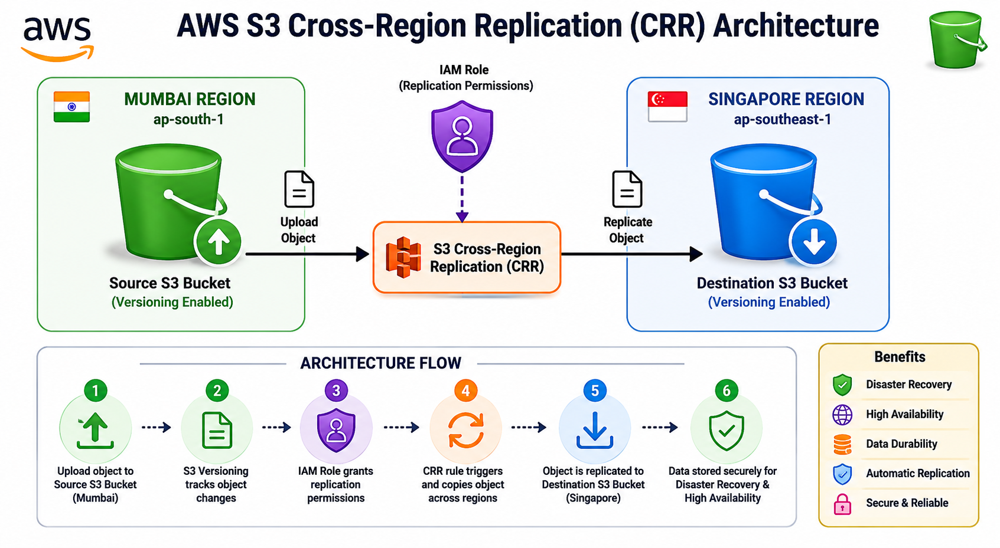
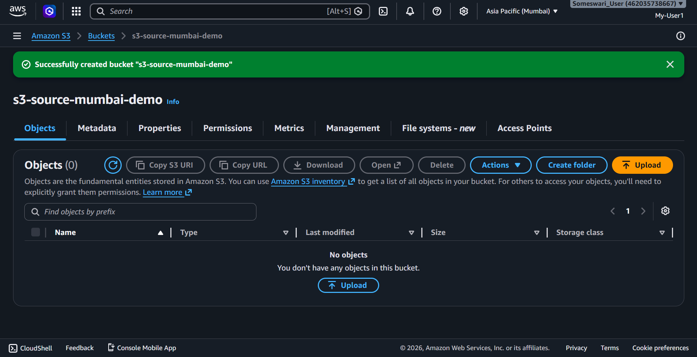
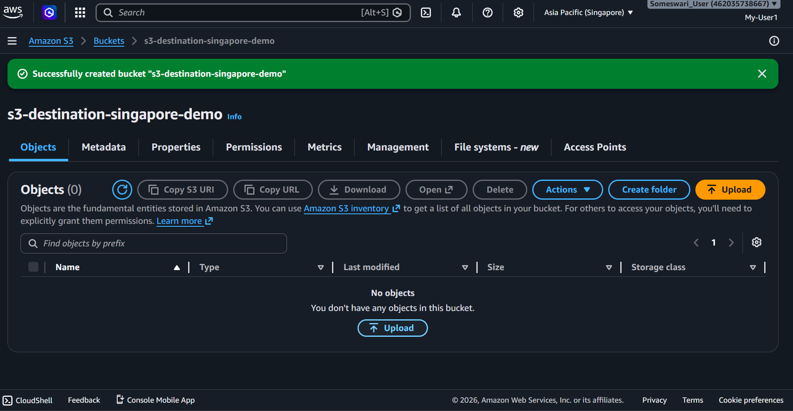
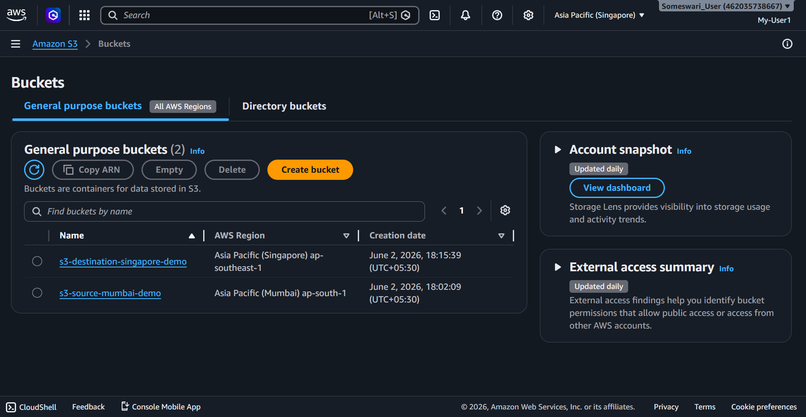
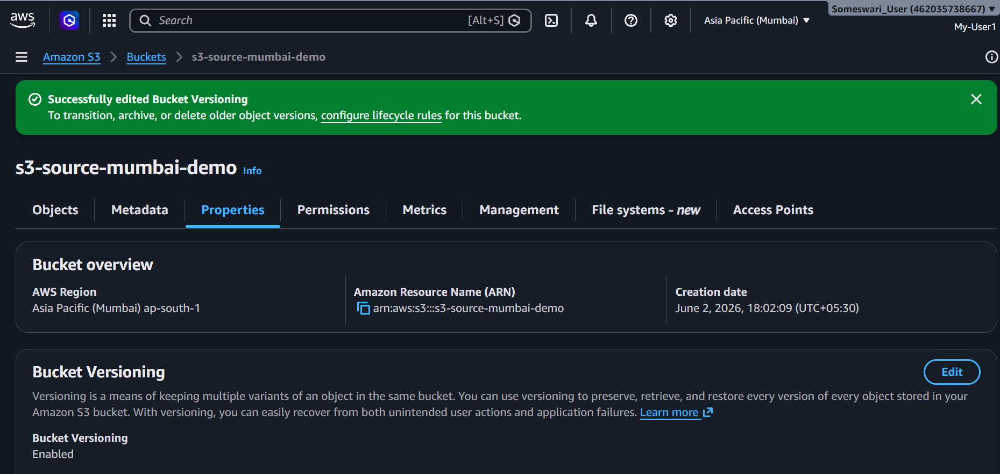
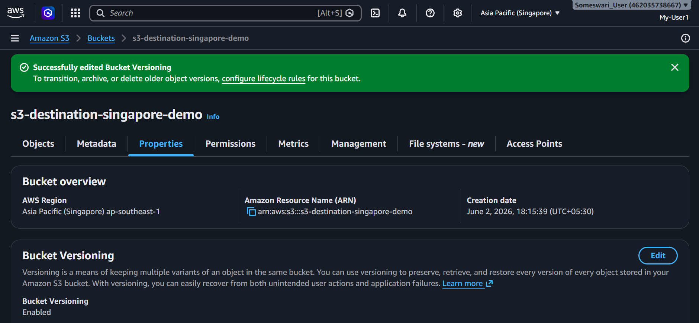
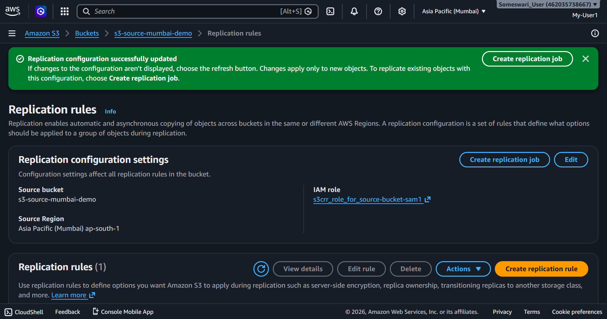
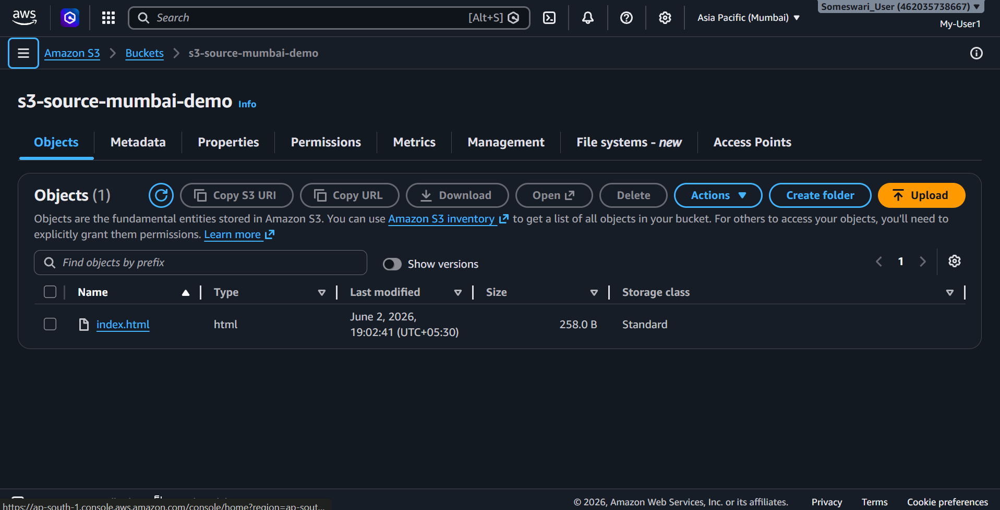
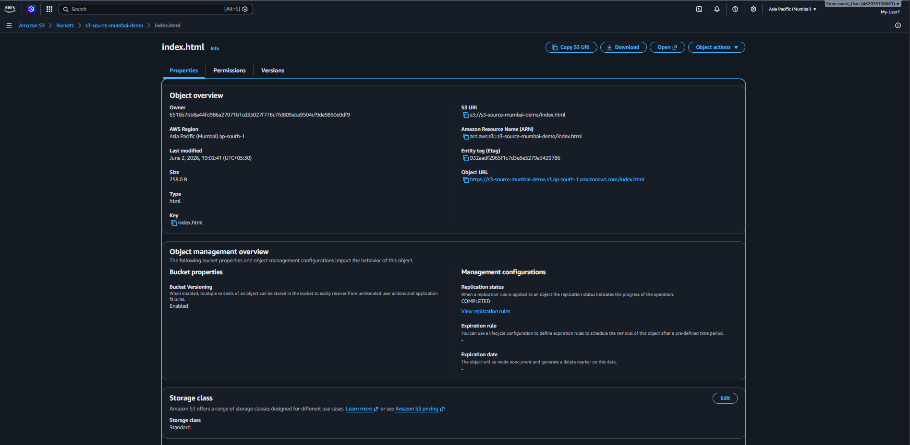
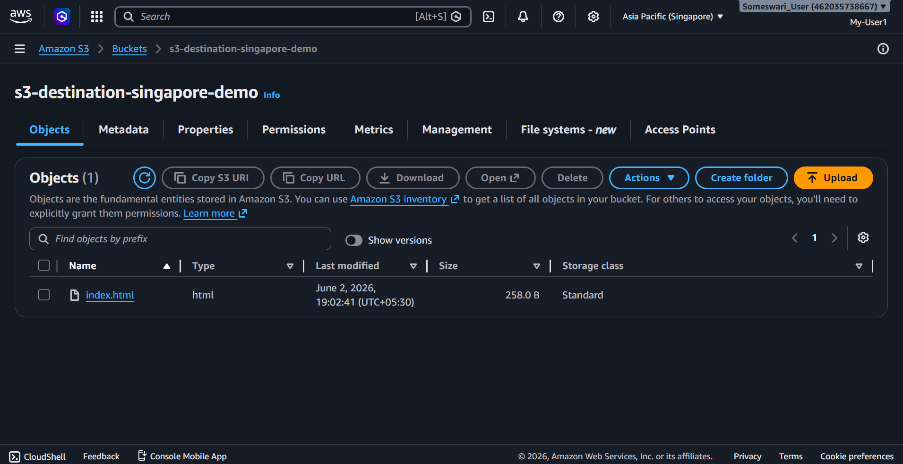

# 🚀 AWS S3 Cross-Region Replication (CRR) | Disaster Recovery Project

## 📌 Project Overview
This project implements Amazon S3 Cross-Region Replication (CRR) to achieve high availability, disaster recovery, and data durability across AWS regions.

The system automatically replicates objects from a source S3 bucket in Mumbai (ap-south-1) to a destination S3 bucket in Singapore (ap-southeast-1), ensuring zero manual intervention.

## 🛠️ Prerequisites
- AWS account
- Basic knowledge of Amazon S3
- IAM role permissions
- Versioning enabled in S3

## ☁️ AWS Services Used
- Amazon S3  
- AWS Identity and Access Management (IAM)  
- S3 Versioning  
- S3 Cross-Region Replication (CRR)

## 🏗️ Architecture

The architecture below shows how data flows from the source S3 bucket in Mumbai region to the destination bucket in Singapore region using AWS Cross-Region Replication.

## 🔄 Workflow

1. User uploads file to source bucket (Mumbai)
2. S3 detects new object
3. Replication rule triggers automatically
4. IAM role authorizes replication
5. Object is copied to destination bucket (Singapore)
6. Replication status marked as COMPLETED

## ⚙️ Implementation Steps

### Step 1: Create Source Bucket (Mumbai Region)

Created S3 bucket in ap-south-1 region.

### Step 2: Create Destination Bucket (Singapore Region)

Created S3 bucket in ap-southeast-1 region.

### Step 3: Verify Both Buckets

- Confirmed both buckets are created in different regions.

### Step 4: Enable Versioning

- Enabled versioning on both buckets.

**Source:**

**Destination:**

### Step 5: Configure Cross-Region Replication

- Created replication rule between source and destination buckets.

### Step 6: IAM Role Creation

- AWS automatically created IAM role for replication.

### Step 7: Upload Test Object to Source Bucket

- Uploaded index.html file to source bucket.

### Step 8: Verify Replication

- Object successfully replicated. 
- Replication status is completed.

### Step 9: Confirm in Destination Bucket

- Verified file exists in destination bucket.

## 🎯 Result
Successfully implemented AWS S3 Cross-Region Replication. 

## 🌍 Real-World Use Case
Cross-Region Replication is widely used in enterprise systems for:

- Disaster recovery and backup
- Global application data synchronization
- Compliance and data residency requirements
- High availability systems

## 📚 Key Learnings
- AWS S3 Cross-Region Replication architecture and workflow  
- Importance of versioning for replication consistency  
- IAM roles and permissions in AWS security model  
- Real-world disaster recovery implementation in cloud  
- Designing highly available cloud storage systems  
---
⭐ If you like this project, give it a star on GitHub!